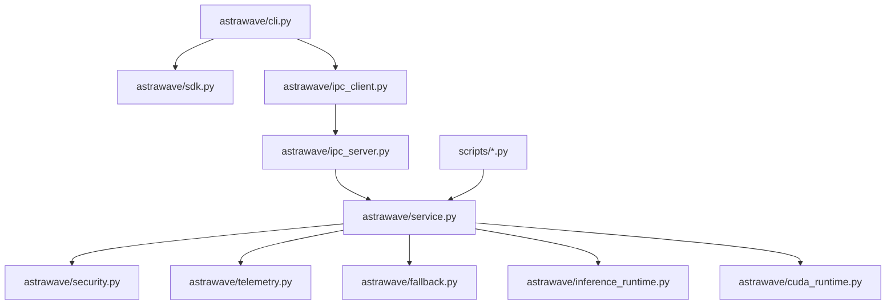

# 00 - Repo Index

## Repository Metrics
| Metric | Value | Evidence |
| --- | --- | --- |
| Total files | `133` | `audit-report/raw/phaseC_repo_metrics.txt` |
| Python files | `43` | `audit-report/raw/phaseC_repo_metrics.txt` |
| Markdown files | `27` | `audit-report/raw/phaseC_repo_metrics.txt` |
| Python LOC | `13,908` | `audit-report/raw/phaseC_repo_metrics.txt` |
| Test files | `17` | `audit-report/raw/phaseC_test_metrics.txt` |
| Test LOC | `3,330` | `audit-report/raw/phaseC_test_metrics.txt` |
| Source LOC (`astrawave` + `scripts`) | `10,578` | `audit-report/raw/phaseC_test_metrics.txt` |
| Test-to-source LOC ratio | `31.48%` | `audit-report/raw/phaseC_test_metrics.txt` |

## Top-Level Composition
| Path | File Count |
| --- | --- |
| `astrawave/` | `19` |
| `scripts/` | `8` |
| `tests/` | `17` |
| `docs/` | `11` |
| `reports/` | `18` |

## Technology Stack
| Layer | Technology | Notes |
| --- | --- | --- |
| Runtime | Python `3.13` | Stdlib-heavy implementation |
| IPC | `multiprocessing.connection` (`AF_PIPE` / `AF_INET`) | Loopback-only guard present |
| Security | SID/PID attestation + policy guard | Caller binding enforced per connection |
| Telemetry | In-memory structured events | Local-only policy default |
| Hardware | `ctypes` (`nvcuda.dll`, NVML) + `nvidia-smi` parsing | Fail-soft probes |
| Test framework | `unittest` primary, `pytest` available | `pytest` default invocation currently broken |

## Module Map

## Confidence
`[HIGH]`
