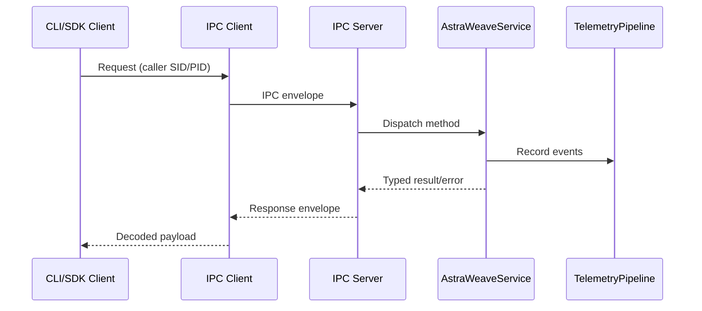

# 01 - Architecture

## Service Flow Diagram

## Findings
| ID | Severity | Confidence | Location | Description | Remediation | Effort |
| --- | --- | --- | --- | --- | --- | --- |
| `AUD-001` | `CRITICAL` | `[HIGH]` | `astrawave\service.py:344`; `service.py:349`; `service.py:374`; `service.py:382`; `service.py:420`; `service.py:423`; `service.py:1007`; `service.py:1012` | `RunStep` transitions to `RUNNING` before input validation and does not restore state when validation raises. Repro result: `state_after RUNNING`, then next call fails with `AW_ERR_INVALID_STATE` (`audit-report/raw/phaseC_runstep_invalid_prompt_probe.txt`). Failure rate in probe: `1/1` (`100%`). | Validate prompt/max_tokens/temperature before setting `session.state = RUNNING`, or add exception rollback that restores previous state on `ApiError`. Add regression test for this exact path. | `S` |
| `AUD-003` | `HIGH` | `[HIGH]` | `astrawave\ipc_client.py:365`; `ipc_client.py:375`; `ipc_client.py:387` | IPC client silently downgrades from named pipe to TCP `127.0.0.1:8765` on pipe connect failure. Probe proved a missing pipe endpoint still succeeded in `CreateSession` via fallback (`audit-report/raw/phaseC_client_pipe_fallback_probe.txt`). Transport downgrade observed: `1/1` (`100%` in forced scenario). | Make fallback explicit and opt-in (`allow_pipe_to_tcp_fallback=False` default). Emit typed downgrade telemetry and return an error unless explicitly permitted. | `M` |
| `AUD-004` | `HIGH` | `[HIGH]` | `astrawave\service.py:144`; `service.py:495`; `service.py:520`; `service.py:562` | Closed sessions are retained indefinitely in `_closed_sessions` with no eviction policy. Probe: `500` create/close cycles left `500` retained sessions (`audit-report/raw/phaseC_closed_sessions_growth_probe.txt`). Approx object footprint sample: `11,154` bytes per closed session (`audit-report/raw/phaseC_closed_session_size_probe.txt`). | Keep only minimal tombstones (`session_id`, `owner_sid`, `closed_at`) with TTL/LRU cap. Introduce max retained tombstones and purge on insert. | `M` |

## Quantified Impact Notes
| ID | Quantification |
| --- | --- |
| `AUD-001` | One bad request can permanently block a session without restart/close; observed immediately after `1` invalid `RunStep`. |
| `AUD-003` | Security posture can change from pipe semantics to loopback TCP without caller awareness. |
| `AUD-004` | Linear memory growth: roughly `~11 KB` per retained closed session in sampled shape; `100k` sessions projects to `~1.0+ GB` heap pressure. |
