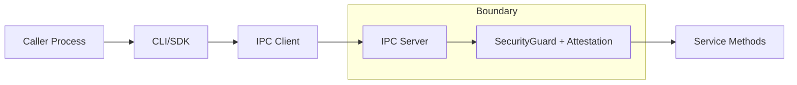

# 03 - Security

## Trust Boundary Diagram

## Findings
| ID | Severity | Confidence | Location | Description | Remediation | Effort |
| --- | --- | --- | --- | --- | --- | --- |
| `AUD-002` | `CRITICAL` | `[HIGH]` | `astrawave/cli.py:829`; `cli.py:830`; `cli.py:1112`; `cli.py:1114`; `astrawave/security.py:270`; `security.py:274` | CLI defaults are incompatible with runtime attestation on remote mode. Default caller uses `pid=1`; attestation rejects it as inactive. Probe with healthy server returned `AW_ERR_AUTH_DENIED` (`audit-report/raw/phaseC_cli_remote_default_failure_probe.txt`). | Default caller PID to `os.getpid()` and SID to `resolve_current_user_sid()` at runtime. Keep override flags for explicit impersonation tests only. | `S` |
| `AUD-003` | `HIGH` | `[HIGH]` | `astrawave/ipc_client.py:375`; `ipc_client.py:387` | Connection security is silently downgraded: missing named pipe endpoint falls back to TCP localhost without operator consent. Probe confirmed successful session creation despite non-existent pipe endpoint (`audit-report/raw/phaseC_client_pipe_fallback_probe.txt`). | Require explicit `--allow-transport-downgrade` (default `false`). Log and surface downgrade in typed response/telemetry. | `M` |
| `AUD-008` | `MEDIUM` | `[MEDIUM]` | `astrawave/cli.py:50`; `cli.py:70`; `cli.py:72`; `cli.py:723`; `cli.py:737` | Local simulator state is stored in a predictable temp file keyed only by endpoint hash. There is no integrity check or signature on persisted state. This allows local state tampering by same-user processes and weakens trust in simulator outputs. | Add file integrity MAC/signature, enforce restrictive ACLs, and optionally place state under user-scoped app-data with explicit lockfile semantics. | `M` |

## Security Quantification
| ID | Quantification |
| --- | --- |
| `AUD-002` | Default remote call failure reproduced in `1/1` attempts (`100%`) against healthy local service. |
| `AUD-003` | Forced missing-pipe scenario downgraded transport and still succeeded in `1/1` attempts (`100%`). |
| `AUD-008` | State file path determinism is `SHA-256(endpoint)`; endpoint knowledge is sufficient to locate file. |

## Confidence
`[HIGH]` for `AUD-002`, `AUD-003`; `[MEDIUM]` for `AUD-008`.
