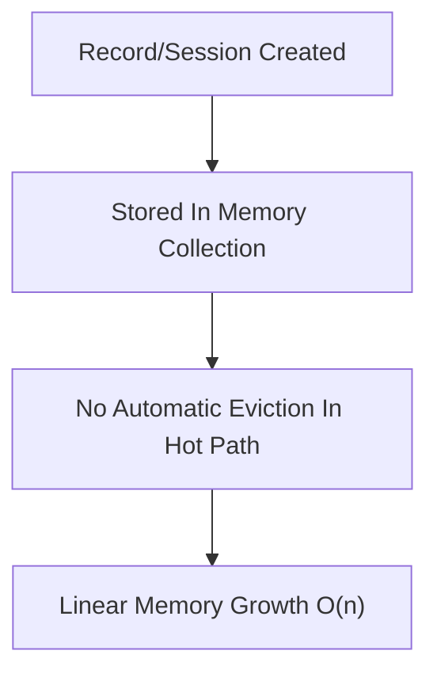

# 04 - Performance

## Memory Growth Model

## Findings
| ID | Severity | Confidence | Location | Description | Remediation | Effort |
| --- | --- | --- | --- | --- | --- | --- |
| `AUD-004` | `HIGH` | `[HIGH]` | `astrawave\service.py:144`; `service.py:520`; `service.py:562` | Closed sessions are retained forever in `_closed_sessions`. Probe: `500` create/close cycles produced `500` retained entries (`audit-report/raw/phaseC_closed_sessions_growth_probe.txt`). | Replace full-session retention with capped tombstones (TTL/LRU). Add configurable hard cap and purge strategy. | `M` |
| `AUD-005` | `HIGH` | `[HIGH]` | `astrawave\telemetry.py:416`; `telemetry.py:483`; `telemetry.py:514`; `telemetry.py:524` | Telemetry records grow indefinitely during normal operation. `record_event` only appends; retention cleanup is only called during export bundle construction. Probe recorded `10,000` events and retained all `10,000` (`audit-report/raw/phaseC_telemetry_growth_probe.txt`). | Perform periodic cleanup in `record_event` or via background scheduler; enforce max in-memory record count. | `M` |

## Quantified Impact
| ID | Measurement | Value |
| --- | --- | --- |
| `AUD-004` | Approx retained memory per closed session (sampled) | `11,154` bytes |
| `AUD-004` | Retained memory at `500` closed sessions | `~5,577,000` bytes (`~5.32 MiB`) |
| `AUD-004` | Projected retained memory at `100,000` closed sessions | `~1.04 GiB` |
| `AUD-005` | Serialized bytes per representative telemetry record | `580` bytes |
| `AUD-005` | Lower-bound growth at `100 events/s` | `~4.67 GiB/day` |
| `AUD-005` | Lower-bound growth at `1,000 events/s` | `~46.7 GiB/day` |

## Confidence
`[HIGH]`
