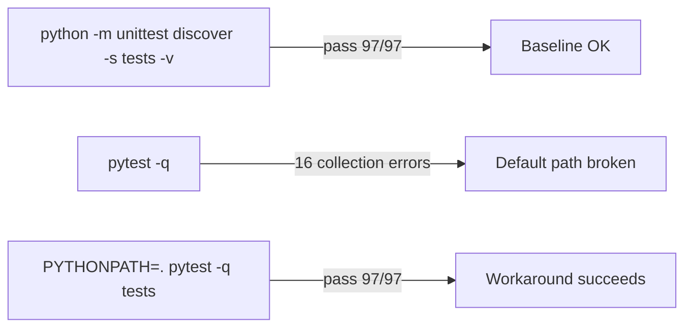

# 05 - Testing

## Test Execution Outcomes

## Findings
| ID | Severity | Confidence | Location | Description | Remediation | Effort |
| --- | --- | --- | --- | --- | --- | --- |
| `AUD-006` | `HIGH` | `[HIGH]` | `tests/test_cli_contract.py:28`; `test_cli_contract.py:40`; `tests/test_release_gate_report_contract.py:36` | Test environment is non-hermetic. Default `pytest -q` failed with `16` collection errors (`audit-report/raw/phaseB_pytest_q.txt`). Passing run requires environment patching (`PYTHONPATH=.` + restricted target). Cleanup code suppresses delete errors (`ignore_errors=True`), allowing artifact drift. | Add `pytest.ini`/`pyproject.toml` test config, install package in editable mode during tests, and make temp cleanup strict with explicit failure handling. | `M` |
| `AUD-001` | `CRITICAL` | `[HIGH]` | `tests/test_service_contract.py:166`; `test_service_contract.py:299`; `astrawave/service.py:1008` | Critical `RunStep` error-state regression was not covered by tests. Query showed no test assertion for prompt-validation failure recovery (`audit-report/raw/phaseC_test_gap_queries.txt`). Existing RunStep tests are success-path dominant. | Add regression tests: invalid prompt, invalid max_tokens, invalid temperature must leave session recoverable (`READY/DEGRADED`) and not `RUNNING`. | `S` |

## Test Metrics
| Metric | Value |
| --- | --- |
| `unittest` discovered tests | `97` |
| `unittest` pass rate | `100%` |
| `pytest` default pass rate | `0%` command success |
| `pytest tests` with `PYTHONPATH=.` pass rate | `100%` |
| Warnings in passing pytest run | `1` (`PytestCacheWarning`) |

## Confidence
`[HIGH]`
