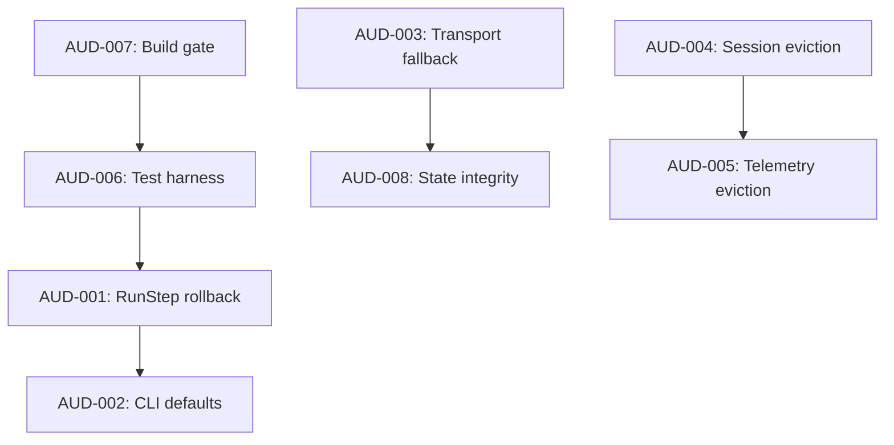

# 06 - Technical Debt & Feature Hardening

## Overview

This section consolidates technical-debt items and feature-hardening recommendations
derived from the architecture, code-quality, security, performance, and testing audits.

## Hardening Roadmap

| Priority | Area | Action | Related Finding | Effort |
| --- | --- | --- | --- | --- |
| `P0` | State machine | Validate `RunStep` inputs before state transition; add rollback on validation error | `AUD-001` | `S` |
| `P0` | Authentication | Default CLI caller identity to `os.getpid()` / `resolve_current_user_sid()` at runtime | `AUD-002` | `S` |
| `P0` | Build system | Add `pyproject.toml` with test, lint, and type-check targets; enforce in CI | `AUD-007` | `M` |
| `P1` | IPC transport | Make pipe-to-TCP fallback explicit and opt-in (`allow_pipe_to_tcp_fallback=False` default) | `AUD-003` | `M` |
| `P1` | Memory | Cap `_closed_sessions` with TTL/LRU eviction; retain only tombstone fields | `AUD-004` | `M` |
| `P1` | Memory | Enforce max in-memory telemetry record count; add periodic background cleanup | `AUD-005` | `M` |
| `P1` | Test harness | Package project for editable install; add `pytest.ini`; remove `PYTHONPATH` injection | `AUD-006` | `M` |
| `P2` | State integrity | Add file integrity MAC/signature and restrictive ACLs to simulator state files | `AUD-008` | `M` |

## Dependency Graph

The dependency graph above shows the recommended implementation order:
- **AUD-007** (build gate) should land first so that subsequent fixes are gated by CI.
- **AUD-006** (test harness) enables writing reliable regression tests for **AUD-001**.
- **AUD-001** and **AUD-002** are independent critical fixes that can proceed in parallel once the test harness is stable.
- **AUD-004** and **AUD-005** share the same eviction-policy pattern and can be implemented together.
- **AUD-003** and **AUD-008** are security-hardening items that can be addressed in a follow-up sprint.

## Confidence
`[HIGH]`
